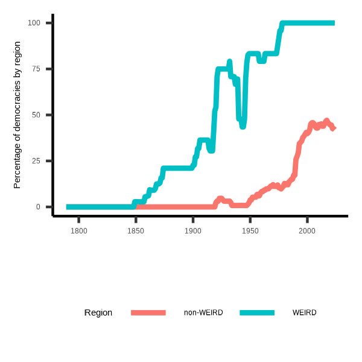

# Data Analysis for the Social Sciences with R
Welcome to the GitHub repository for the Data Analysis for the Social Sciences with R class (AY 24/25). On this site, you will find code, data, and other material we will use in class.
## Syllabus
- [Syllabus](Syllabus.pdf)
## Data and codebook
In the first part of the class, we will work with data on Tunisia. Below are the codebook and the data of a survey we fielded there in 2022 as well as data files containing the resulst of the 2014 and 2019 legislative elections in Tunisia. 
- [Codebook Tunisia Survey](Codebook-TUN-Survey.pdf)
- [Data Tunisia Survey](tunisia_survey.csv)
- [2014 Electoral Results](res2014.csv)
- [2019 Electoral Results](res2019.csv)
## Slides and code files
### Session 1: Getting set up
- [Slides session 1](Session-1.pdf)
- [Code session 1](#)
### Session 2: Data management
- [Slides session 2](Session-2.pdf)
- [Electoral results from Wikipedia](Scrape-Wikipedia.R)
### Session 3: Data visualization
- [Slides session 3](Session-3.pdf)
- [ggplot2 cheat sheet](https://github.com/rstudio/cheatsheets/blob/main/data-visualization.pdf)
#### Plots to reproduce:

The first four plots use the Tunisia survey data, the final four use the [V-Dem data](https://github.com/vdeminstitute/vdemdata). Feel free to pick any plot to start with--no need to follow the sequence or reproduce them all. 

- [Code](plot_code.R)

### Session 4: R programming
- [Slides session 4](Session-4.pdf)
- [Code session 4](#)
#### Turkish MPs data
The file below contains the names, constituencies, and terms of 12,992 Turkish politicians having served in the Turkish Grand National Assembly between the first (1922-23) and 27th (2018-22) terms. 
- [Turkish MPs, 1st to 27th term](turkish_mps.csv)

Here is a table with Turkish special characters and their Latin equivalents:

| Turkish Small Letter | Latin Small Equivalent | Turkish Capital Letter | Latin Capital Equivalent |
|----------------------|------------------------|------------------------|--------------------------|
| ç                    | c                      | Ç                      | C                        |
| ş                    | s                      | Ş                      | S                        |
| ğ                    | g                      | Ğ                      | G                        |
|                      |                        | İ                      | I                        |
| ı                    | i                      |                        |                          |
| ö                    | o                      | Ö                      | O                        |
| ü                    | u                      | Ü                      | U                        |

### Session 5: Exploring data
- [Slides session 5](Session-5.pdf)
- [Markdown code EDA](EDA.Rmd)
- [EDA report (PDF version)](EDA.pdf)
  
### Session 6: Linear regression
- [Slides session 6](#)
- [Code session 6](#)

### Session 7: Replication I: U.S. Soft-Power and Foreign Policy Behavior

We will reproduce the analysis in the article below. Make sure to read it carefully before class. 

-  Goldsmith, Benjamin E. and Yusaku Horiuchi. 2012. "In Search of Soft Power: Does Foreign Public Opinion Matter for US Foreign Policy?" *World Politics* 64 (3): 555-585. [doi:10.1017/S0043887112000123](https://www.cambridge.org/core/journals/world-politics/article/in-search-of-soft-power-does-foreign-public-opinion-matter-for-us-foreign-policy/0C9DB5A0FB1EF43767932DE4E2C4DCEF)
-  The data are available [here](https://github.com/joshuaalley/cross-sectional-ols)
-  [Code session 7](#)

### Session 8: Logistic regression
- [Slides session 8](#)
- [Code session 8](#)

### Sesssion 9: Replication II - Does Counterbalancing Prevent Military Coups?

We will reproduce the analysis in the article below. Make sure to read it carefully before class. 

-  De Bruin, Erica. 2018. "Preventing Coups d’état: How Counterbalancing Works." *Journal of Conflict Resolution* 62 (7): 1433–58. [doi: 10.1177/0022002717692652](https://doi.org/10.1177/0022002717692652)
-  The data are available [here](https://journals.sagepub.com/doi/abs/10.1177/0022002717692652)
-  [Code session 9](#)

### Session 10: TBD
